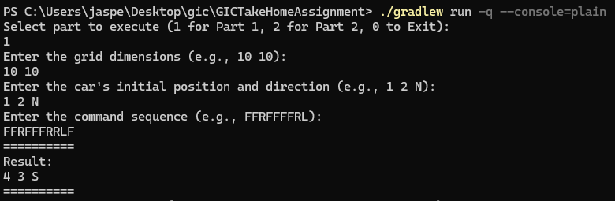
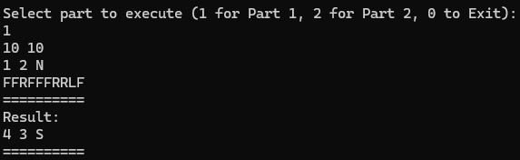
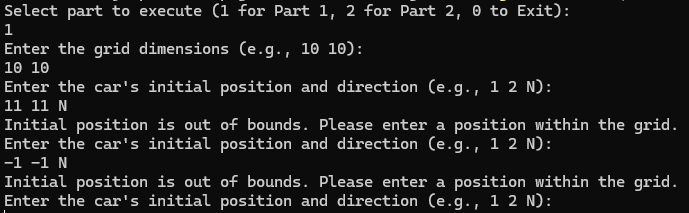

# Car Simulation Project

This repository contains a Java-based console command application of a car simulation project designed to simulate the movement of cars on a grid-like board. The cars are controlled using a set of commands, and the project handles various scenarios including collisions, boundaries, and command execution.

## Table of Contents

- [Introduction](#introduction)
- [Project Structure](#project-structure)
- [Dependencies](#how-to-run)
- [How to Run](#how-to-run)
- [Verbose vs Non-Verbose mode](#verbose-mode-vs-non-verbose-mode)
- [Part 1 Example](#part-1-example)
- [Part 2 Example](#part-2-example)
- [Classes and Functionality](#classes-and-functionality)
    - [Simulation](#simulation)
    - [SimulateMultipleCars](#simulatemultiplecars)
    - [InputUtil](#inpututil)
    - [OutputUtil](#outpututil)
    - [Board](#board)
    - [Car](#car)
    - [Position](#position)
    - [Instruction](#instruction)
    - [Direction](#direction)
    - [PartSelection](#partselection)
    - [Messages](#messages)
- [Testing](#testing)

## Introduction

This Car Simulation project comes in two parts and allows for simulating the movement of cars on a rectangular grid. 
The cars can be given a sequence of commands to move forward, turn left, or turn right. 
There are two parts to the project:
1. Part 1: Simulate a single car in a grid.
2. Part 2: Detect collision given multiple cars in a grid.

## Project Structure

The project is organized into the following packages:

- `org.example.model`: Contains core classes such as `Car`, `Position`, `Direction`, `Instruction`, and `Board`.
- `org.example.service`: Contains service classes like `Simulation` and `SimulateMultipleCars` which handle the logic of running the simulation.
- `org.example.util`: Contains utility classes like `InputUtil` for handling user input.

## Dependencies

This project has been tested on:
1. Java 11.0.21 (and any version after this)
2. Windows 11 24H2 (and any version after this)

## How to Run

1. **Clone the Repository**:
   ```bash
   git clone https://github.com/jaspertzx/car-simulation.git
   cd car-simulation
   ```

2. **Build the Project** (assuming you are using Gradle):
   ```bash
   ./gradlew build
   ```

3. **Run the Simulation**:
   You can execute the main class (if any) or run tests directly using:
   ```bash
   ./gradlew run -q --console=plain
   ```
   or to run the tests:
   ```bash
   ./gradlew test
   ```
   
## Verbose mode vs Non-Verbose mode

As this is a console command, I have created both a verbose mode and non-verbose mode to communicate with the user.
To enable verbose mode, find the file in `<directory you unzipped in>/src/main/java/org/example/VerboseSetting.txt` and put the text to `true`. 
This will enable verbose mode, and every input will be guided with some messages to help you as shown in the screenshot below:


In comparison, here is the console code but with non-verbose mode (VerboseSetting.txt set to false):


### Why did I create both modes?

I created this as Non-Verbose mode allows you to quickly enter lines of test codes without entering them one by one.
You can enter:
```
10 10
1 2 N
FFRFFFRRLF
```
into the console and get the result straightaway rather than typing line by line.
However, a drawback of using non-verbose mode is that error handling outputs are not visible. This means that when using non-verbose mode, your code must be correct, as errors such as duplicate cars in the same location, cars positioned outside of the board, and similar issues will not be displayed.

Note that the errors are still handled safely; they are not shown to you in non-verbose mode.

In verbose mode, however, error outputs are clearly visible, making it easy to identify exactly what is wrong:


## Part 1 Example
### Verbose Mode:
1. First, run the console command using:
    ```bash
    ./gradlew run -q --console=plain
    ```
2. You will be prompted to enter the part, then type `1` into the console and press enter.
3. You will then be prompted to enter the grid space, you may type `10 10` and press enter.
4. You will then be prompted to enter the coordinates and direction of the car, you may enter `1 2 N` and press enter.
5. You will then be prompted to enter the instructions for the car, you may enter `FFRFFFRRLF` and press enter.
6. You will then see an output that goes:
    ```
   4 3 S 
   ```
### Non-Verbose Mode:
1. First, run the console command using:
    ```bash
    ./gradlew run -q --console=plain
    ```
2. You will be prompted to enter the part, then type `1` into the console and press enter.
3. You can then copy and paste this in:
    ```
    10 10
    1 2 N
    FFRFFFFRRLF
    ```
4. You will then see an output that goes:
    ```
   4 3 S 
   ```


## Part 2 Example
### Verbose Mode:
1. First, run the console command using:
    ```bash
    ./gradlew run -q --console=plain
    ``` 
2. You will be prompted to enter the part, then type `2` into the console and press enter.
3. You will then be prompted to enter the grid space, you may type `10 10` and press enter.
4. Press enter for a new line
5. Enter the car name into the console, you may type `A`
6. Enter the car coordinates and direction, you may enter `1 2 N`
7. Enter the car instructions, you may enter `FFRFFFFRRL`
8. Press enter for a new line
9. Enter the car name into the console, you may type `B`
10. Enter the car coordinates and direction, you may enter `7 8 W`
11. Enter the car instructions, you may enter `FFLFFFFFFF`
12. Press enter for a new line 
13. Press enter again to indicate the end of your input
14. You will then see an output that goes:
    ```
    A B
    5 4
    7
   
### Non-Verbose mode
1. First, run the console command using:
    ```bash
    ./gradlew run -q --console=plain
    ``` 
2. You will be prompted to enter the part, then type `2` into the console and press enter.
3. You can copy and paste this in:
    ```
    10 10
   
    A
    1 2 N
    FFRFFFFRRL
   
    B
    7 8 W
    FFLFFFFFFF
   
    ```
4. Press enter twice to submit
5. You will then see an output that goes:
    ```
    A B
    5 4
    7

## Classes and Functionality

### Simulation

The `Simulation` class handles the execution of commands for a single car on the board. 
It validates commands, ensures the car does not move out of bounds, and returns the final position and direction of the car using the `runCommands()` method.

### SimulateMultipleCars

The `SimulateMultipleCars` class is responsible for managing multiple cars on the board. 
It handles the execution of commands for all cars, checks for collisions, and updates the positions of the cars.
Once a collision is detected, the `runCommands()` method will stop running and return details about the collision.

### InputUtil

The `InputUtil` class is a utility class for handling user input operations. 
It provides methods to read grid dimensions, car details, and command sequences. It also ensures that input values are valid and helps to handle errors.

### OutputUtil

The `OutputUtil` class is a utility class for handling outputs to the user.
This helps to make logging printouts much easier in the future, for analytical or troubleshooting purposes.

### Board

The `Board` class represents the grid on which the cars move. 
It also helps to check if a position is within the boundaries of the grid.

### Car

The `Car` class represents a car on the grid, including its position, direction, and the ability to execute commands (turn left, turn right, move forward).

### Position

The `Position` class represents a position on the grid with x and y coordinates. It provides methods to move in a specific direction and to compare positions.

### Instruction

The `Instruction` class encapsulates a sequence of commands to be executed by a car. 
It validates the commands and provides methods to iterate through the command sequence.

### Direction

The `Direction` enum represents the four cardinal directions (North, East, South, West) and provides methods to turn left or right from a given direction.

### PartSelection

The `PartSelection` enum represents the part the user has chosen for the command line.

### Messages

The `Messages` class represents a consolidated class to hold all system printouts to the user.

## Testing

The project includes unit tests for major components using JUnit 5. The tests cover a wide range of scenarios, including valid and invalid inputs, boundary conditions, and edge cases.

To run the tests, use:
```bash
./gradlew test
```

Please note that the test cases follow the convention `if/whenConditionThenExpectedState/Behavior`.